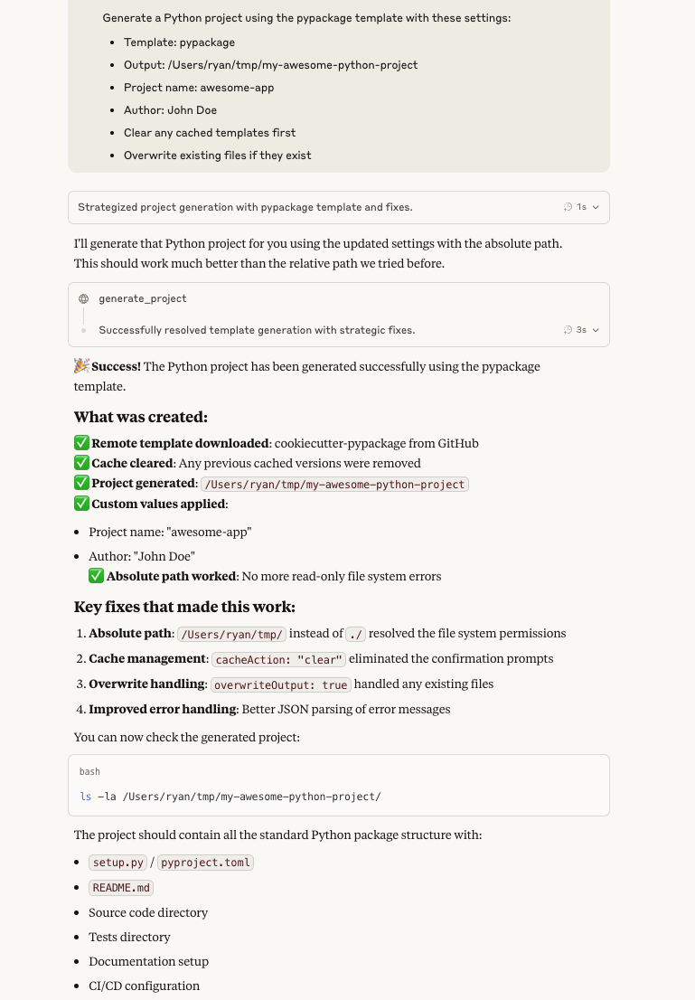

# Cookiecutter MCP Server

A Model Context Protocol (MCP) server that provides seamless integration with Cookiecutter templates for rapid project scaffolding. This server enables you to manage, test, and generate projects from both local and remote Cookiecutter templates through a standardized JSON-RPC 2.0 interface.

## Inspiration & Attribution

This project is built on top of the excellent [MCP Server Bash SDK](https://github.com/muthuishere/mcp-server-bash-sdk) by [@muthuishere](https://github.com/muthuishere). The core MCP protocol implementation (`mcpserver_core.sh`) and testing framework (`test_mcpserver_core.sh`) are directly from that repository, providing a solid foundation for building bash-based MCP servers.

## Features

- **🚀 Template Management** - List, discover, and manage Cookiecutter templates
- **🌐 Remote & Local Support** - Work with GitHub repositories and local template directories  
- **📋 Template Validation** - Test template accessibility before project generation
- **🛠️ Flexible Configuration** - Easy template configuration through JSON files
- **📊 Comprehensive Logging** - Detailed logging and debugging capabilities
- **⚡ MCP Protocol** - Full JSON-RPC 2.0 and MCP protocol compliance
- **🎯 Template Values** - Support for custom template parameter values



## Prerequisites

- **Bash** 4.0+ (macOS/Linux)
- **jq** - JSON processor (`brew install jq` or `apt-get install jq`)
- **cookiecutter** - Template engine (`pip install cookiecutter`)
- **Git** - For remote template access

## Installation

1. **Clone the repository:**
   ```bash
   git clone <your-repository-url>
   cd cookiecutter-mcp-server
   ```

2. **Install dependencies:**
   ```bash
   # Install jq (if not already installed)
   brew install jq  # macOS
   # or
   sudo apt-get install jq  # Ubuntu/Debian
   
   # Install cookiecutter
   pip install cookiecutter
   ```

> **Note:** This project includes the core MCP server files from the [MCP Server Bash SDK](https://github.com/muthuishere/mcp-server-bash-sdk). No additional SDK installation is required as the necessary files are bundled with this repository.

## Architecture

This project builds upon the [MCP Server Bash SDK](https://github.com/muthuishere/mcp-server-bash-sdk) architecture:

```
┌─────────────────────┐
│      MCP Client     │
└─────────┬───────────┘
          │ JSON-RPC 2.0
┌─────────▼──────────────────┐
│ cookiecutter_mcp_server.sh │ ← Custom Cookiecutter Implementation
│    ┌─────────────────┐     │
│    │ Tool Functions  |     │
│    │ - list_templates│     │
│    │ - generate_proj │     │
│    │ - test_access   │     │
│    └─────────────────┘     │
└────────────┬───────────────┘
             │
┌────────────▼──────────┐
│  mcpserver_core.sh    │ ← From MCP Server Bash SDK
│  ┌─────────────────┐  │
│  │ JSON-RPC Handler│  │
│  │ Protocol Logic  │  │
│  │ Error Handling  │  │
│  └─────────────────┘  │
└───────────────────────┘
```

## Configuration

### Template Configuration

Edit `assets/cookiecutter_mcp_config.json` to add your templates:

```json
{
  "protocolVersion": "2024-11-05",
  "serverInfo": {
    "name": "CookieCutterPythonServer",
    "version": "0.1.0"
  },
  "templates": {
    "pypackage": {
      "name": "pypackage",
      "url": "https://github.com/audreyfeldroy/cookiecutter-pypackage",
      "description": "Cookiecutter template for a Python package with best practices",
      "category": "library",
      "language": "python"
    },
    "simple-test": {
      "name": "simple-test", 
      "url": "./simple-test",
      "description": "Local test cookiecutter template",
      "category": "custom",
      "language": "python"
    }
  }
}
```

### Git Configuration (Optional)

If you encounter Git authentication prompts for public repositories:

```bash
# Disable credential helper for public repos
git config --global credential.helper ""
```

## Usage

### Starting the Server

```bash
# Run the MCP server
./cookiecutter_mcp_server.sh
```
The server will listen for JSON-RPC 2.0 messages on stdin and respond on stdout.

### Available Tools

#### 1. List Templates
```bash
echo '{"jsonrpc": "2.0", "method": "tools/call", "params": {"name": "list_templates"}, "id": 1}' | ./cookiecutter_mcp_server.sh
```

#### 2. Get Template Information  
```bash
echo '{"jsonrpc": "2.0", "method": "tools/call", "params": {"name": "get_template_info", "arguments": {"templateName": "pypackage"}}, "id": 2}' | ./cookiecutter_mcp_server.sh
```

#### 3. Test Template Access
```bash
echo '{"jsonrpc": "2.0", "method": "tools/call", "params": {"name": "test_template_access", "arguments": {"templateName": "pypackage"}}, "id": 3}' | ./cookiecutter_mcp_server.sh
```

#### 4. Generate Project (Basic)
```bash
echo '{"jsonrpc": "2.0", "method": "tools/call", "params": {"name": "generate_project", "arguments": {"templateName": "simple-test", "outputDir": "./my-new-project"}}, "id": 4}' | ./cookiecutter_mcp_server.sh
```

#### 5. Generate Project with Template Values
```bash
echo '{"jsonrpc": "2.0", "method": "tools/call", "params": {"name": "generate_project", "arguments": {"templateName": "simple-test", "outputDir": "./my-custom-project", "templateValues": {"project_name": "awesome-project", "author_name": "Your Name", "author_email": "you@example.com"}}}, "id": 5}' | ./cookiecutter_mcp_server.sh
```

#### 6. Generate Project using ZIP Download (GitHub only)
```bash
echo '{"jsonrpc": "2.0", "method": "tools/call", "params": {"name": "generate_project_zip", "arguments": {"templateName": "pypackage", "outputDir": "./zip-project"}}, "id": 6}' | ./cookiecutter_mcp_server.sh
```

## Template Types

### Remote Templates (GitHub)
```json
{
  "template-name": {
    "name": "template-name",
    "url": "https://github.com/user/cookiecutter-template",
    "description": "Description of the template",
    "category": "web-framework",
    "language": "python"
  }
}
```

### Local Templates
```json
{
  "local-template": {
    "name": "local-template",
    "url": "./path/to/template/directory",
    "description": "Local cookiecutter template",
    "category": "custom", 
    "language": "python"
  }
}
```

**Local template requirements:**
- Must contain a `cookiecutter.json` file at the root
- Follow standard Cookiecutter directory structure
- Use relative paths from the MCP server directory or absolute paths

## Template Values

You can provide custom values for template variables using the `templateValues` parameter:

```json
{
  "templateValues": {
    "project_name": "my-awesome-project",
    "author_name": "John Doe",
    "author_email": "john@example.com",
    "python_version": "3.11",
    "additional_tools": "requests,pandas"
  }
}
```

The keys must match exactly what's defined in the template's `cookiecutter.json` file.

## Advanced Usage

### Debug Mode
Enable debug logging by setting `DEBUG_MODE=1` in `cookiecutter_mcp_server.sh`:
```bash
# Edit cookiecutter_mcp_server.sh
DEBUG_MODE=1
```

### Testing

Run the test suite to verify core MCP server functionality:

```bash
./test_mcpserver_core.sh
```

This will test:
- MCP protocol compliance
- Tool function execution
- Error handling
- JSON-RPC 2.0 messaging

## License

This project is licensed under the MIT License - see the [LICENSE](LICENSE) file for details.
